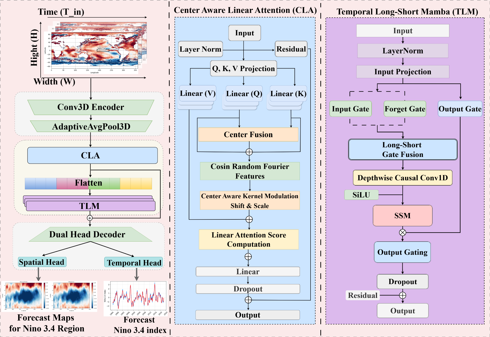

# CLATLM: Center Aware Spatiotemporal Framework for Long-Lead ENSO Forecasting

Official PyTorch implementation for the paper:

**Center Aware Spatiotemporal Framework with Linear-Time Complexity for Efficient Long Lead ENSO Forecasting**

The main model is **CLATLM**, an ENSO forecasting framework that combines:

- **Center Aware Linear Attention (CLA)** for adaptive spatial center-of-action learning with linear-time attention.
- **Temporal Long-Short Mamba (TLM)** for efficient long-range temporal dependency modeling without autoregressive rollouts.
- **Spatial Pattern and Content (SPC) Loss**, which combines MSE content fidelity with a spatial correlation term.




## Highlights

- Efficient Long-lead ENSO forecasting up to 24 months.
- CMIP6 pretraining and NOAA OISST v2.1 fine-tuning/evaluation.
- CLA spatial module with center aware linear attention.
- TLM temporal module based on long-short gated Mamba dynamics.
- SPC loss.


## Datasets

This repository is configured for:

1. **CMIP6 MIROC-ES2L historical `tos`** for pretraining.
2. **NOAA OISST v2.1 monthly SST** for fine-tuning and testing.

Data files are not included because NetCDF climate datasets are large. Place files as follows, or edit `configs/default.yaml`:

```text
data/
├── CMIP6_tos_Omon_MIROC-ES2L_historical_r1i1p1f2_gr1_185001-201412.nc
└── NOAA_OISST_v2_1/
    └── sst.mnmean.nc
```

Expected variables:

- CMIP6: `tos`
- NOAA OISST v2.1: `sst`

The data pipeline converts longitude to 0-360 format, extracts the target ENSO region, interpolates both datasets to a common grid, calculates monthly SST anomalies, normalizes without using the OISST test period, and builds sliding windows.


## Installation

### Conda

```bash
conda env create -f environment.yml
conda activate clatlm-enso
```

### Pip

```bash
python -m venv .venv
source .venv/bin/activate  # Windows: .venv\Scripts\activate
pip install -r requirements.txt
```

## Run the full experiment

```bash
python scripts/run_full_pipeline.py --config configs/default.yaml
```

## License

This project is licensed under the MIT License.
